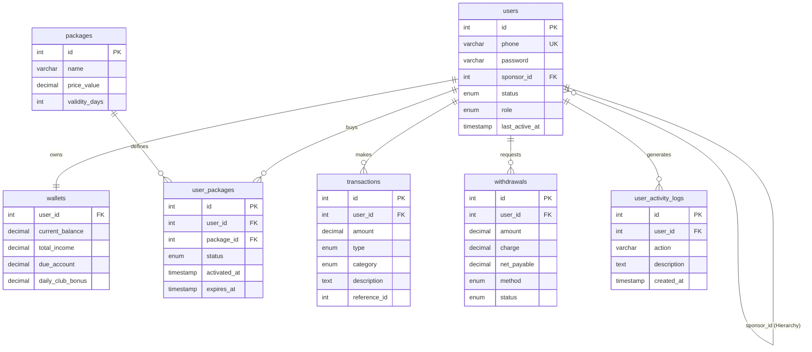

# Database Schema Design: Proyojon Plus

This document outlines the structured database schema for the Proyojon Plus platform, based on the Data Flow System (DFT) and PRD requirements. The database uses MySQL to ensure ACID compliance for all financial transactions.

---

## 1. Core Tables & Columns

### Table: `users`
- **id**: Primary Key (Auto Increment).
- **phone**: VARCHAR (Unique) - Used for authentication (No email).
- **password**: VARCHAR (Hashed).
- **sponsor_id**: INT (Foreign Key referencing `users.id` - nullable for top admin).
- **status**: ENUM ('active', 'inactive', 'banned') - Default 'inactive'.
- **role**: ENUM ('user', 'admin') - Default 'user'.
- **last_active_at**: TIMESTAMP (To track the 30-day customer package validity).

### Table: `wallets`
*(One-to-One relationship with users. Stores all financial balances)*
- **user_id**: INT (Foreign Key).
- **current_balance**: DECIMAL.
- **total_income**: DECIMAL.
- **daily_club_bonus**: DECIMAL.
- **salary_club**: DECIMAL.
- **hajj_club**: DECIMAL.
- **shareholder_club**: DECIMAL.
- **hajj_lottery_club**: DECIMAL.
- **reward_point**: DECIMAL.
- **monthly_prize_point**: DECIMAL.
- **due_account**: DECIMAL (Tracks the accumulated 36% cancellation fee for Gold Package).

### Table: `packages`
*(Stores the static 3 package types)*
- **id**: Primary Key.
- **name**: VARCHAR ('Customer', 'Shareholder', 'Gold').
- **price_value**: DECIMAL (1000 PV, 5000 SP, or 5000 GP).
- **validity_days**: INT (30 for Customer, NULL/365 for others).

### Table: `user_packages`
*(Many-to-Many relationship tracking which user bought which package)*
- **id**: Primary Key.
- **user_id**: INT (Foreign Key).
- **package_id**: INT (Foreign Key).
- **status**: ENUM ('active', 'expired', 'canceled').
- **activated_at**: TIMESTAMP.
- **expires_at**: TIMESTAMP (Crucial for Customer 30-day and Gold 365-day timer).

### Table: `transactions`
*(The core ledger for ACID compliance. ALL money movements must be logged here)*
- **id**: Primary Key.
- **user_id**: INT (Foreign Key).
- **amount**: DECIMAL.
- **type**: ENUM ('credit', 'debit').
- **category**: ENUM ('deposit', 'withdrawal', 'transfer', 'generation_bonus', 'referral_bonus', 'club_bonus', 'gold_daily_drip', 'due_account_penalty').
- **description**: TEXT (e.g., "Level 1 Generation Bonus from User X").
- **reference_id**: INT (Nullable - Can store related user_id or package_id).

### Table: `withdrawals`
- **id**: Primary Key.
- **user_id**: INT (Foreign Key).
- **amount**: DECIMAL (Requested amount).
- **charge**: DECIMAL (5% deduction).
- **net_payable**: DECIMAL.
- **method**: ENUM ('Bank', 'bKash', 'Nagad', 'Rocket').
- **account_details**: TEXT.
- **status**: ENUM ('pending', 'approved', 'rejected').

### Table: `products`
*(For E-commerce adjustments)*
- **id**: Primary Key.
- **name**: VARCHAR.
- **price**: DECIMAL.
- **pv_value**: DECIMAL.
- **dealer_commission_percentage**: DECIMAL (Default 5.00).

### Table: `user_activity_logs`
*(For Admin tracking / Audit Log)*
- **id**: Primary Key.
- **user_id**: INT (Foreign Key).
- **action**: VARCHAR (e.g., 'LOGIN', 'PACKAGE_PURCHASE', 'PASSWORD_RESET').
- **ip_address**: VARCHAR.
- **description**: TEXT.
- **created_at**: TIMESTAMP.

---

## 2. Crucial Relationships & Indexes
1. **Generation Tree Optimization:** Add an index on `users.sponsor_id`. Since the platform needs to calculate 5 levels deep, optimized self-referencing joins are required.
2. **Referential Integrity:** Ensure `ON DELETE RESTRICT` for `user_id` in wallets and transactions so financial data is never accidentally orphaned.
3. **ACID Enforcement:** Design instructions for the Express.js API to use `MySQL Transactions (BEGIN, COMMIT, ROLLBACK)` whenever writing to the `transactions` and `wallets` tables simultaneously.

---

## 3. Cron Job Requirements (Data Flags)
Ensure the schema supports the following daily automated queries:
- Query to find users where `user_packages.package_id = [Gold Package ID]` AND `status = 'active'` to distribute the daily 1.8%/365 drip.
- Query to find users where `user_packages.package_id = [Customer Package ID]` AND `expires_at < NOW()` to update their status to 'inactive'.

---

## 4. Entity-Relationship (ER) Diagram

