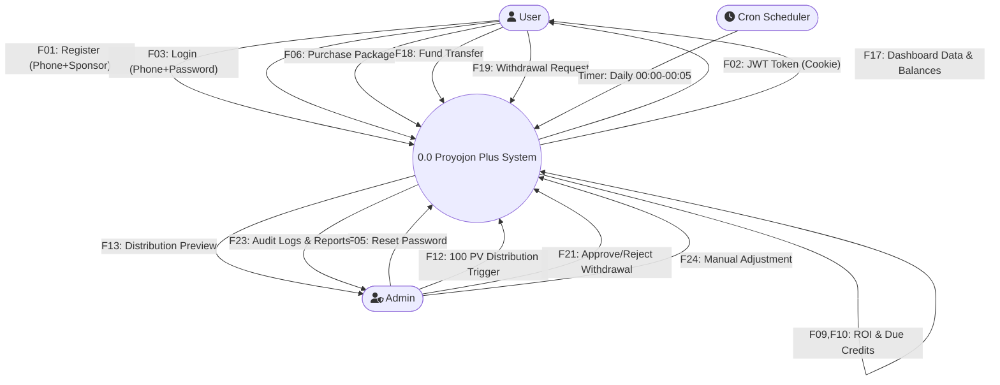
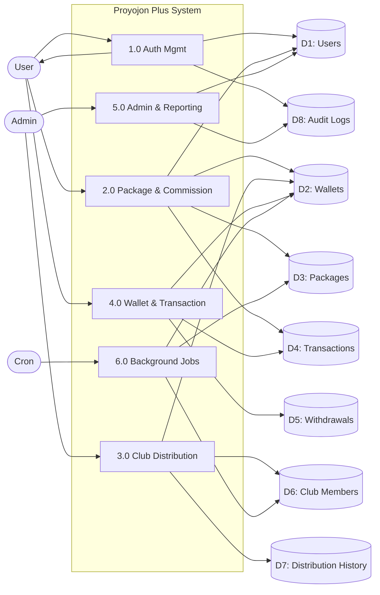
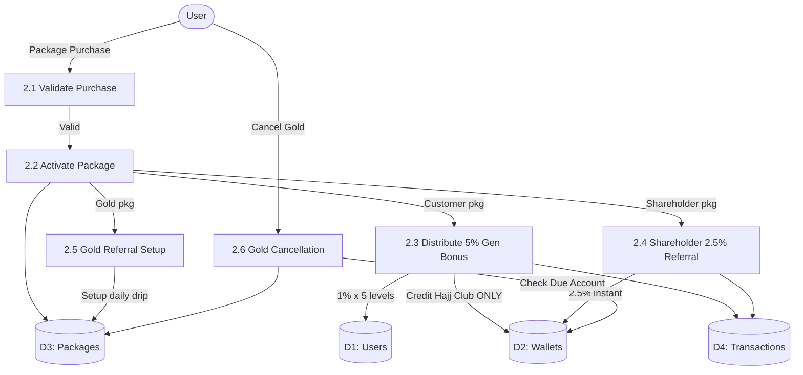
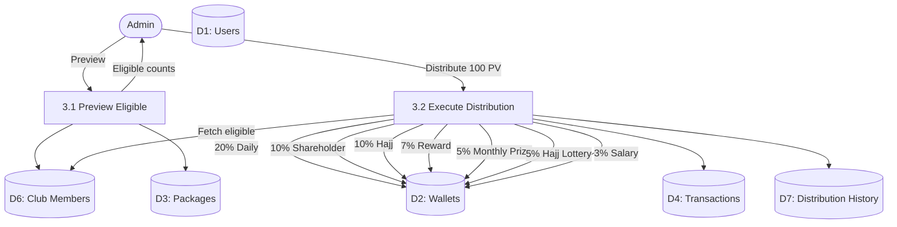

# Data Flow System Documentation (DFT)
**Project Name:** Proyojon Plus (MLM E-commerce & Investment Platform)

---

## 1. Context Diagram (Level 0 DFD)

The Context Diagram represents the entire Proyojon Plus platform as a single process interacting with external entities.

**External Entities:**
- **User**: Registers (Phone + Sponsor ID), logs in, purchases packages (Customer/Shareholder/Gold), views dashboard & wallet balances, transfers funds (ID-to-ID), requests withdrawals (Bank/bKash/Nagad/Rocket), views generation network table (Level 1–5), and views club membership statuses.
- **Admin**: Manages all user accounts (view/reset password/ban), triggers the 100 PV Global Distribution, approves/rejects withdrawals, manually adjusts balances/prizes, configures Dealer commissions, and views comprehensive system reports (Sales, Withdrawals, Club Funds, Active/Inactive Users, Due Accounts).
- **Cron Scheduler (Internal)**: Automated daily jobs that execute Gold Package ROI drip-feed, update Due Accounts, check Customer Package expiry (30-day rule), and auto-promote Salary Club members.

**Central Process:**
- **0.0 Proyojon Plus System**: Handles all MLM logic, financial transactions, commission calculations, club distributions, and reporting.

---

## 2. Level 1 DFD

The Level 1 DFD breaks the main system into 6 major sub-processes.

### Processes:
| Process | Name | Description | PRD Reference |
|---------|------|-------------|---------------|
| **1.0** | Authentication Management | Registration (Phone + Sponsor ID, NO email). Login (Phone + Password → JWT). Forgot Password → "Contact Admin" page. Admin manual password reset. | PRD §1 |
| **2.0** | Package & Commission Management | Purchase of Customer (1000 PV), Shareholder (5000 SP), Gold (5000 GP) packages. Multi-package independence. 5% Generation Bonus (1% × 5 levels → Hajj Club only). Shareholder 2.5% instant referral. Gold 1.8% daily drip-feed. Due Account calculation. | PRD §1, §2 |
| **3.0** | Club Distribution Management | Admin-triggered 100 PV distribution: 20% Daily, 10% Shareholder, 10% Hajj, 7% Reward, 5% Monthly Prize, 5% Hajj Lottery, 3% Salary. Equal split among eligible members per club. Salary Club auto-promotion (15 direct Customer referrals). | PRD §3 |
| **4.0** | Wallet & Transaction Management | View all 9 wallet balances. ID-to-ID fund transfers with row-level locking. Withdrawal requests (Bank/bKash/Nagad/Rocket) with flat 5% charge. | PRD §4 |
| **5.0** | Admin Control & Reporting | User CRUD (view/ban/reset password). Individual user audit logs (login, purchases, transfers, withdrawals, club achievements). Manual balance/prize adjustments. Dealer commission config. Macro reports (Sales, Withdrawals, Club Funds, Active/Inactive, Due Accounts). | PRD §5 |
| **6.0** | Automated Background Jobs | Daily Gold ROI credit. Daily Due Account update. Midnight Customer Package expiry check. Salary Club auto-promotion scan. | PRD §2C, §2A, §3 |

### Data Stores:
| Store | Name | Content | Accessed By |
|-------|------|---------|-------------|
| **D1** | Users DB | Phone, password hash, sponsor_id (MLM tree), role, status, is_dealer | 1.0, 2.0, 3.0, 4.0, 5.0, 6.0 |
| **D2** | Wallets DB | current_balance, total_income, daily_club, salary_club, hajj_club, shareholder_club, hajj_lottery_club, reward_point, monthly_prize_point, due_account | 2.0, 3.0, 4.0, 5.0, 6.0 |
| **D3** | Packages DB | package_type, point_amount, status, activation/expiry dates, monthly_accumulated_pv, countdown_end_date | 2.0, 5.0, 6.0 |
| **D4** | Transactions DB | type (credit/debit), amount, wallet_field, purpose, reference_id, description | 2.0, 3.0, 4.0, 5.0 |
| **D5** | Withdrawals DB | amount, charge (5%), net_amount, method (Bank/bKash/Nagad/Rocket), account details, status (Pending/Approved/Rejected) | 4.0, 5.0 |
| **D6** | Club Memberships DB | club_type, is_eligible, joined_at | 3.0, 5.0, 6.0 |
| **D7** | Distribution History DB | Admin trigger logs with per-club amounts and eligible member counts | 3.0, 5.0 |
| **D8** | Audit Logs DB | action, details (JSON), ip_address, timestamps | 1.0, 2.0, 4.0, 5.0 |
| **D9** | Fund Transfers DB | sender_id, receiver_id, amount | 4.0, 5.0 |
| **D10** | Dealer Products DB | product name, price, pv_value, dealer_commission_rate | 2.0, 5.0 |

---

## 3. Level 2 DFD

### Process 1.0: Authentication Management (Breakdown)
| Sub-Process | Description | Reads From | Writes To |
|-------------|-------------|------------|-----------|
| **1.1 Register User** | Validates phone uniqueness, validates sponsor_id exists in D1, hashes password (bcrypt), creates user record with status='inactive'. | D1 | D1, D2 (create empty wallet), D8 (audit) |
| **1.2 Login User** | Verifies phone exists, compares bcrypt hash, checks user not banned, generates JWT (access + refresh token), sets HttpOnly cookie. | D1 | D8 (audit: login event) |
| **1.3 Forgot Password** | Returns static Admin contact info. No DB write. | — | — |
| **1.4 Admin Reset Password** | Admin searches user by ID/phone, sets new bcrypt hash. | D1 | D1 (password_hash), D8 (audit: password_reset) |

### Process 2.0: Package & Commission Management (Breakdown)
| Sub-Process | Description | Reads From | Writes To |
|-------------|-------------|------------|-----------|
| **2.1 Validate Purchase** | Checks if user already has an active package of same type (allows multiple different types). Validates sufficient balance if paying from wallet. | D1, D2, D3 | — |
| **2.2 Activate Package** | Creates package record. Sets activation_date, expiry_date (Customer: +30 days), countdown_end_date (Gold: +365 days). If first package, sets user status='active'. | D3 | D3, D1 (status update), D8 (audit) |
| **2.3 Distribute 5% Generation Bonus** | Traverses 5 sponsor levels upward via sponsor_id chain in D1. For each active upline: credits 1% of PV to their Hajj Club in D2. **Crucial: goes to Hajj Club ONLY, NOT Current Balance.** Skips inactive uplines. | D1 (sponsor chain), D3 (active check) | D2 (hajj_club), D4 (transaction log) |
| **2.4 Shareholder Referral Commission** | On Shareholder Package purchase: credits 2.5% of SP instantly to direct referrer's Current Balance. | D1 (sponsor_id) | D2 (current_balance), D4 (transaction log) |
| **2.5 Gold Referral Commission Setup** | On Gold Package purchase: calculates (1.8% × GP) ÷ 365 = daily amount. Stores this for cron job execution. Does NOT pay instantly. | D3 | — (cron reads this later) |
| **2.6 Gold Package Cancellation** | Validates buyer has paid accumulated Due Account amount to Admin. Sets Gold Package status='canceled'. Stops referrer's daily drip-feed immediately. | D2 (due_account), D3 | D3 (status), D8 (audit) |

### Process 3.0: Club Distribution Management (Breakdown)
| Sub-Process | Description | Reads From | Writes To |
|-------------|-------------|------------|-----------|
| **3.1 Preview Distribution** | Admin views eligible member counts per club before triggering. Shareholder Club = only Shareholder Package buyers. Salary Club = users with ≥15 direct Customer referrals. | D1, D3, D6 | — (read only) |
| **3.2 Execute Distribution** | Admin clicks "Distribute". System calculates: 20% → Daily, 10% → Shareholder, 10% → Hajj, 7% → Reward, 5% → Monthly Prize, 5% → Hajj Lottery, 3% → Salary. Each club's portion ÷ eligible member count = per-member credit. Entire operation wrapped in DB Transaction. | D6 | D2 (all wallet fields), D4 (transaction logs), D7 (distribution history) |

### Process 4.0: Wallet & Transaction Management (Breakdown)
| Sub-Process | Description | Reads From | Writes To |
|-------------|-------------|------------|-----------|
| **4.1 View Wallet Balances** | Returns all 9 wallet fields + due_account for the authenticated user. Shows all club names/statuses even if not eligible (Universal Club Visibility). | D2, D6 | — |
| **4.2 Fund Transfer (ID-to-ID)** | Validates sender has sufficient current_balance. Uses SELECT...FOR UPDATE (row lock) on both sender and receiver wallets. Debits sender, credits receiver. Both within single transaction. | D1, D2 | D2, D4 (transaction logs), D9 (fund_transfers), D8 (audit) |
| **4.3 Request Withdrawal** | User submits amount + method (Bank/bKash/Nagad/Rocket) + account details. System calculates 5% charge and net_amount. Creates withdrawal record with status='pending'. Deducts from current_balance immediately (hold). | D2 | D2, D5, D4 (transaction log), D8 (audit) |

### Process 5.0: Admin Control & Reporting (Breakdown)
| Sub-Process | Description | Reads From | Writes To |
|-------------|-------------|------------|-----------|
| **5.1 User Audit Log** | Admin searches by User ID. Displays complete timeline: logins, purchases, transfers, withdrawals, club achievements. | D8, D4, D5, D9 | — |
| **5.2 User Management** | View user profile/credentials, reset password, lock/ban/unban user ID. | D1 | D1, D8 (audit) |
| **5.3 Withdrawal Approval** | Admin views pending withdrawal queue. Approves (triggers actual payout) or Rejects (refunds held amount back to current_balance). | D5 | D5, D2 (refund on reject), D8 (audit) |
| **5.4 Manual Adjustments** | Admin directly adds balance or awards prize to any user's wallet. | — | D2, D4, D8 (audit) |
| **5.5 Dealer Commission Config** | Admin marks users as dealers, sets commission rate (default 5%) for physical products. | D1, D10 | D1 (is_dealer), D10 |
| **5.6 System Reports** | Aggregated reports: Overall Sales (sum of D3 purchases), Total Withdrawals (sum of D5), Club Fund History (D7), Active vs Inactive user counts (D1), Due Account logs (D2 filtered). | D1, D2, D3, D4, D5, D7 | — |

### Process 6.0: Automated Background Jobs (Breakdown)
| Sub-Process | Schedule | Description | Reads From | Writes To |
|-------------|----------|-------------|------------|-----------|
| **6.1 Gold Daily ROI** | 00:01 AM | For each active Gold Package: (1.8% × GP) ÷ 365 → credit to referrer's Current Balance. Skips if package is canceled. | D3 (active Gold packages), D1 (referrer) | D2 (referrer's current_balance), D4 (transaction log) |
| **6.2 Gold Due Account** | 00:02 AM | For each active Gold Package buyer: (36% × 100,000) ÷ 365 = 98.63 → add to buyer's Due Account daily. | D3 | D2 (due_account) |
| **6.3 Customer Expiry** | 00:00 AM | For each Customer Package where activation_date + 30 days ≤ NOW() AND monthly_accumulated_pv < 100: set package status='expired', set user status='inactive'. All generation/referral income stops. | D3, D1 | D3 (status), D1 (status), D8 (audit) |
| **6.4 Salary Club Scan** | 00:05 AM | For each user: count direct referrals (sponsor_id = user.id) who have active Customer Package. If count ≥ 15 AND user not already in Salary Club → create Club Membership record. | D1, D3, D6 | D6 (new membership), D8 (audit: club_achievement) |

---

## 4. Data Dictionary

| Data Element | Description | Format / Type | Constraints | PRD Reference |
|--------------|-------------|---------------|-------------|---------------|
| `Registration_Data` | New user registration payload | `{ phone: string, password: string, sponsor_id: int }` | phone: unique, 11 digits. sponsor_id: must exist in Users. No email field. | PRD §1 |
| `Auth_Token` | JWT stored in HttpOnly cookie | String (JWT) | Access: 15 min expiry. Refresh: 7 days. HttpOnly + Secure + SameSite=Strict | PRD §1 |
| `Package_Purchase` | Request to buy a specific package | `{ user_id: int, package_type: enum }` | package_type: 'customer' (1000 PV) / 'shareholder' (5000 SP) / 'gold' (5000 GP). Can hold all 3 simultaneously. | PRD §1, §2 |
| `Generation_Bonus` | 5% commission split across 5 levels | `{ upline_id: int, level: int, amount: decimal }` | 1% per level. Credits Hajj Club ONLY (not Current Balance). Skips inactive uplines. | PRD §2A |
| `Shareholder_Referral` | Instant 2.5% of SP to referrer | `{ referrer_id: int, amount: decimal }` | Credits Current Balance directly. | PRD §2B |
| `Gold_ROI_Daily` | Daily drip-feed for Gold referral | `{ referrer_id: int, daily_amount: decimal }` | (1.8% × GP) ÷ 365. Stops on cancellation. | PRD §2C |
| `Due_Account_Daily` | Gold buyer's daily cancellation penalty | `{ buyer_id: int, daily_due: decimal }` | (36% × 100,000) ÷ 365 = ~98.63/day. Must be paid on cancellation. | PRD §2C |
| `Distribution_Trigger` | Admin command to distribute 100 PV | `{ admin_id: int, base_pv: 100 }` | Splits: 20+10+10+7+5+5+3 = 60% | PRD §3 |
| `Club_Eligibility` | User's eligibility for each club | `{ club_type: enum, is_eligible: boolean }` | Shareholder Club: must own Shareholder Package. Salary Club: ≥15 direct Customer referrals. All clubs visible regardless. | PRD §3, §4 |
| `Fund_Transfer` | ID-to-ID balance transfer | `{ sender_id: int, receiver_id: int, amount: decimal }` | Deducts from sender's current_balance. Uses row-level lock. | PRD §4 |
| `Withdrawal_Request` | User cash-out request | `{ user_id: int, amount: decimal, method: enum, account_number: string, account_holder_name: string }` | method: 'bank'/'bkash'/'nagad'/'rocket'. Flat 5% charge. net = amount × 0.95 | PRD §4 |
| `Wallet_Balances` | All wallet fields for a user | `{ current_balance, total_income, daily_club, salary_club, hajj_club, shareholder_club, hajj_lottery_club, reward_point, monthly_prize_point, due_account }` | All DECIMAL(15,2). Visible to all users (Universal Visibility). | PRD §4 |
| `Audit_Event` | User activity log entry | `{ user_id: int, action: string, details: JSON, ip: string }` | Actions: login, package_purchase, fund_transfer, withdrawal_request, club_achievement, password_reset, account_banned | PRD §5 |
| `Dealer_Commission` | Commission on physical product sales | `{ dealer_id: int, product_id: int, rate: decimal }` | Default 5%. Admin configurable. | PRD §5 |
| `Generation_Network` | User's downline in table format | `{ level: int, users: Array }` | Levels 1–5. Table view ONLY, no graphical tree. | PRD §4 |

---

## 5. Data Flow Table

| Flow ID | Flow Name | Source | Destination | Data Elements Carried | PRD Ref |
|---------|-----------|--------|-------------|----------------------|---------|
| F01 | Registration Request | User | 1.0 Auth | phone, password, sponsor_id | §1 |
| F02 | Auth Token (Cookie) | 1.0 Auth | User | JWT access + refresh token | §1 |
| F03 | Login Credentials | User | 1.0 Auth | phone, password | §1 |
| F04 | Forgot Password Redirect | 1.0 Auth | User | Admin contact phone number | §1 |
| F05 | Admin Password Reset | Admin | 1.0 Auth | target_user_id, new_password | §1 |
| F06 | Package Purchase Request | User | 2.0 Packages | user_id, package_type | §2 |
| F07 | Generation Bonus Credits | 2.0 Packages | D2 Wallets | upline_id, 1% per level → hajj_club | §2A |
| F08 | Shareholder Referral Credit | 2.0 Packages | D2 Wallets | referrer_id, 2.5% → current_balance | §2B |
| F09 | Gold ROI Daily Credit | 6.0 Cron Jobs | D2 Wallets | referrer_id, daily_amount → current_balance | §2C |
| F10 | Due Account Daily Update | 6.0 Cron Jobs | D2 Wallets | buyer_id, daily_due → due_account | §2C |
| F11 | Gold Cancellation Request | User | 2.0 Packages | package_id, due_payment_confirmation | §2C |
| F12 | Distribution Command | Admin | 3.0 Distribution | base_pv (100), trigger event | §3 |
| F13 | Club Preview Data | 3.0 Distribution | Admin | eligible_counts per club | §3 |
| F14 | Distribution Credits | 3.0 Distribution | D2 Wallets | per-member amounts across 7 clubs | §3 |
| F15 | Distribution Log | 3.0 Distribution | D7 History | per-club amounts, member counts, timestamp | §3 |
| F16 | Wallet Balance Query | User | 4.0 Wallet | user_id | §4 |
| F17 | Wallet Balance Response | 4.0 Wallet | User | all 9 balances + due_account + club statuses | §4 |
| F18 | Fund Transfer Request | User | 4.0 Wallet | sender_id, receiver_id, amount | §4 |
| F19 | Withdrawal Request | User | 4.0 Wallet | amount, method, account_details | §4 |
| F20 | Withdrawal Queue | D5 Withdrawals | 5.0 Admin | pending withdrawal list | §5 |
| F21 | Approval/Rejection | Admin | 5.0 Admin | withdrawal_id, decision, admin_note | §5 |
| F22 | Audit Log Query | Admin | 5.0 Admin | target_user_id | §5 |
| F23 | Audit Log Response | D8 Audit Logs | Admin | full activity timeline | §5 |
| F24 | Manual Adjustment | Admin | 5.0 Admin | target_user_id, wallet_field, amount | §5 |
| F25 | Generation Network Query | User | 2.0 Packages | user_id, level (1–5) | §4 |
| F26 | Network Table Data | D1 Users | User | paginated downline list per level | §4 |
| F27 | Package Expiry Trigger | 6.0 Cron Jobs | D3 Packages | expired package IDs, user status updates | §2A |
| F28 | Salary Club Promotion | 6.0 Cron Jobs | D6 Clubs | newly eligible user_ids | §3 |
| F29 | Dealer Config Update | Admin | 5.0 Admin | user_id, is_dealer, commission_rate | §5 |
| F30 | System Reports | D1,D2,D3,D4,D5,D7 | Admin | aggregated sales, withdrawals, club funds, user stats, due logs | §5 |

---

## 6. Process Table

| Process ID | Process Name | Input Flows | Output Flows | Data Stores Used | Description |
|------------|--------------|-------------|--------------|-----------------|-------------|
| 1.0 | Authentication Mgmt | F01, F03, F05 | F02, F04 | D1, D2, D8 | Registers users (phone+sponsor), authenticates via JWT, handles admin password resets |
| 2.0 | Package & Commission | F06, F11, F25 | F07, F08, F26 | D1, D2, D3, D4, D8 | Purchases packages, distributes generation/referral bonuses, handles Gold cancellation |
| 3.0 | Club Distribution | F12 | F13, F14, F15 | D1, D2, D3, D4, D6, D7 | Admin triggers 100 PV split across 7 clubs for eligible members |
| 4.0 | Wallet & Transaction | F16, F18, F19 | F17, F20 | D2, D4, D5, D8, D9 | Manages balances, P2P transfers (with row locks), and withdrawal creation |
| 5.0 | Admin & Reporting | F21, F22, F24, F29 | F23, F30 | D1, D2, D3, D4, D5, D7, D8, D10 | User CRUD, audit logs, withdrawal approvals, manual adjustments, dealer config, reports |
| 6.0 | Background Cron Jobs | Timer (daily) | F09, F10, F27, F28 | D1, D2, D3, D6, D8 | Automated: Gold ROI, Due Account, Package Expiry, Salary Club promotion |

---

## 7. Data Store Table

| Store ID | Store Name | Description | Tables | Accessed By |
|----------|------------|-------------|--------|-------------|
| D1 | Users DB | User credentials, MLM hierarchy (sponsor_id), role, status, dealer flag | `users` | 1.0, 2.0, 3.0, 4.0, 5.0, 6.0 |
| D2 | Wallets DB | All 9 wallet balances + due_account per user | `wallets` | 2.0, 3.0, 4.0, 5.0, 6.0 |
| D3 | Packages DB | Active/expired/canceled user packages with dates, PV accumulator, countdown | `user_packages` | 2.0, 3.0, 5.0, 6.0 |
| D4 | Transactions DB | Unified financial ledger (credits, debits, purposes, references) | `transactions` | 2.0, 3.0, 4.0, 5.0 |
| D5 | Withdrawals DB | Withdrawal requests with amount, 5% charge, method, approval status | `withdrawals` | 4.0, 5.0 |
| D6 | Club Memberships DB | User eligibility per club type (daily, shareholder, hajj, hajj_lottery, salary, reward, monthly_prize) | `club_memberships` | 3.0, 5.0, 6.0 |
| D7 | Distribution History DB | Logs of each 100 PV distribution: per-club amounts, eligible counts | `club_distribution_history` | 3.0, 5.0 |
| D8 | Audit Logs DB | Full activity trail per user (login, purchase, transfer, withdrawal, achievement, ban) | `audit_logs` | 1.0, 2.0, 4.0, 5.0 |
| D9 | Fund Transfers DB | Sender-to-receiver transfer records | `fund_transfers` | 4.0, 5.0 |
| D10 | Dealer Products DB | Physical products with PV values and configurable dealer commission rates | `dealer_products` | 2.0, 5.0 |

---

## 8. Mermaid Diagrams

### 8.1 Context Diagram (Level 0 DFD)



### 8.2 Level 1 DFD



### 8.3 Level 2 DFD — Package & Commission (Process 2.0)



### 8.4 Level 2 DFD — Club Distribution (Process 3.0)



---

## 9. Draw.io XML (Context Diagram)

*Copy the XML below and paste into Draw.io (app.diagrams.net) → Extras → Edit Diagram → paste → Apply.*

```xml
<mxfile host="app.diagrams.net">
  <diagram name="DFD Context Diagram" id="dfd-context-001">
    <mxGraphModel dx="1200" dy="1000" grid="1" gridSize="10" guides="1" tooltips="1" connect="1" arrows="1" fold="1" page="1" pageScale="1" pageWidth="1100" pageHeight="850" math="0" shadow="0">
      <root>
        <mxCell id="0" />
        <mxCell id="1" parent="0" />

        <!-- External Entities -->
        <mxCell id="User" value="User" style="rounded=0;whiteSpace=wrap;html=1;fillColor=#dae8fc;strokeColor=#6c8ebf;fontSize=14;fontStyle=1;" vertex="1" parent="1">
          <mxGeometry x="80" y="180" width="140" height="70" as="geometry" />
        </mxCell>
        <mxCell id="Admin" value="Admin" style="rounded=0;whiteSpace=wrap;html=1;fillColor=#fff2cc;strokeColor=#d6b656;fontSize=14;fontStyle=1;" vertex="1" parent="1">
          <mxGeometry x="780" y="180" width="140" height="70" as="geometry" />
        </mxCell>
        <mxCell id="Cron" value="Cron Scheduler&#xa;(Internal)" style="rounded=0;whiteSpace=wrap;html=1;fillColor=#e1d5e7;strokeColor=#9673a6;fontSize=12;fontStyle=1;" vertex="1" parent="1">
          <mxGeometry x="430" y="500" width="140" height="60" as="geometry" />
        </mxCell>

        <!-- Central System -->
        <mxCell id="System" value="0.0&#xa;Proyojon Plus&#xa;System" style="ellipse;whiteSpace=wrap;html=1;aspect=fixed;fillColor=#d5e8d4;strokeColor=#82b366;fontSize=14;fontStyle=1;" vertex="1" parent="1">
          <mxGeometry x="390" y="140" width="220" height="220" as="geometry" />
        </mxCell>

        <!-- User → System -->
        <mxCell id="F01" value="Register / Login / Purchase / Transfer / Withdraw" style="endArrow=classic;html=1;fontSize=11;" edge="1" parent="1" source="User" target="System">
          <mxGeometry relative="1" as="geometry" />
        </mxCell>
        <!-- System → User -->
        <mxCell id="F02" value="JWT Token / Dashboard Data / Balances" style="endArrow=classic;html=1;fontSize=11;exitX=0;exitY=0.75;entryX=1;entryY=0.75;" edge="1" parent="1" source="System" target="User">
          <mxGeometry relative="1" as="geometry" />
        </mxCell>

        <!-- Admin → System -->
        <mxCell id="F12" value="100 PV Trigger / Approvals / Config / Adjustments" style="endArrow=classic;html=1;fontSize=11;" edge="1" parent="1" source="Admin" target="System">
          <mxGeometry relative="1" as="geometry" />
        </mxCell>
        <!-- System → Admin -->
        <mxCell id="F23" value="Audit Logs / Reports / Preview Data" style="endArrow=classic;html=1;fontSize=11;exitX=1;exitY=0.75;entryX=0;entryY=0.75;" edge="1" parent="1" source="System" target="Admin">
          <mxGeometry relative="1" as="geometry" />
        </mxCell>

        <!-- Cron → System -->
        <mxCell id="FC1" value="Daily: Gold ROI / Due Account / Expiry / Salary Promotion" style="endArrow=classic;html=1;fontSize=11;" edge="1" parent="1" source="Cron" target="System">
          <mxGeometry relative="1" as="geometry" />
        </mxCell>
      </root>
    </mxGraphModel>
  </diagram>
</mxfile>
```

---

## 10. Validation Report

### ✅ Completeness Check
| Criteria | Status | Details |
|----------|--------|---------|
| All PRD entities covered | ✅ Pass | User, Admin, Cron (internal) |
| All 3 packages documented | ✅ Pass | Customer (1000 PV), Shareholder (5000 SP), Gold (5000 GP) |
| Multi-package independence | ✅ Pass | Process 2.2: one expiry doesn't affect others |
| 5% Generation Rule (1% × 5 levels → Hajj Club ONLY) | ✅ Pass | Process 2.3: credits hajj_club, NOT current_balance |
| Shareholder 2.5% instant referral | ✅ Pass | Process 2.4: credits current_balance |
| Gold 1.8% daily drip-feed | ✅ Pass | Process 6.1: cron job, stops on cancellation |
| Gold Due Account (36% ÷ 365) | ✅ Pass | Process 6.2: daily accumulation |
| 100 PV distribution (7 clubs, exact %) | ✅ Pass | Process 3.2: 20+10+10+7+5+5+3 |
| Shareholder Club eligibility (Shareholder buyers only) | ✅ Pass | D6 + Process 3.1 filter |
| Salary Club (15 direct Customer referrals) | ✅ Pass | Process 6.4: auto-promotion |
| No Tree View (Table only) | ✅ Pass | Process 2.0 / Flow F25-F26 |
| All 9 wallets + due_account | ✅ Pass | D2 schema: current, total, daily, salary, hajj, shareholder, hajj_lottery, reward, monthly_prize, due |
| Universal Club Visibility | ✅ Pass | Process 4.1: shows all clubs even if not eligible |
| Fund Transfer (ID-to-ID) | ✅ Pass | Process 4.2: with row-level locking |
| Withdrawal (5% charge, Bank/bKash/Nagad/Rocket) | ✅ Pass | Process 4.3: flat 5% |
| Admin audit log (full user timeline) | ✅ Pass | D8 + Process 5.1 |
| Admin user management (view/reset/ban) | ✅ Pass | Process 5.2 |
| Admin manual adjustments | ✅ Pass | Process 5.4 |
| Dealer 5% commission | ✅ Pass | Process 5.5, D10 |
| Admin withdrawal approve/reject | ✅ Pass | Process 5.3 |
| System reports (5 types) | ✅ Pass | Process 5.6 |
| Customer 30-day expiry + 100 PV reactivation | ✅ Pass | Process 6.3 |
| Forgot Password → Contact Admin (no OTP) | ✅ Pass | Process 1.3 |
| Gold 365-day countdown timer | ✅ Pass | countdown_end_date in D3, rendered in frontend |

### ✅ Data Flow Integrity
- Every process has at least one input and one output flow.
- No data store is directly connected to an external entity — all pass through a process.
- All data elements in the Data Dictionary are referenced in at least one Data Flow.
- All 30 data flows (F01–F30) are documented with source, destination, and carried data.

### ✅ Architecture Alignment
- All 6 DFD processes map directly to the Service Layer in `architecture.md`.
- All 10 Data Stores map to the 10 Database Tables in `architecture.md` §4.
- All cron jobs in Process 6.0 match the Background Jobs in `architecture.md` §3C.
